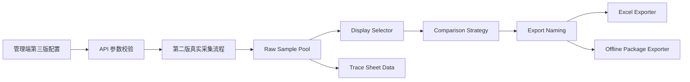

# 青猫差旅比价工具第三版全栈技术路线图

日期：2026-05-31

状态：方案已通过，作为第三版开发技术依据。

## 1. 技术路线结论

第三版继续沿用现有本地优先架构：

- React + TypeScript + Vite 管理端。
- Express 本地 API。
- Playwright 附着已登录浏览器进行真实采集。
- ExcelJS 生成 Excel。
- 离线 HTML 包生成销售交付物。
- Vitest 做策略层、导出层、数据规则测试。

第三版不换框架、不上公网服务、不重写采集器。

核心技术动作是增加一层稳定的第三版策略层：



## 2. 模块分工

| 层级 | 职责 | 第三版改动 |
|---|---|---|
| 管理端 UI | 用户配置、触发采集、查看状态、导出 | 新增展示数量、生成模式、优势比例、比价口径、文件名预览 |
| API 层 | 接收配置、校验、触发采集、返回状态 | 扩展完整采集参数和当前批次状态 |
| 采集层 | 四平台真实采集、截图、失败留痕 | 原则上不改主逻辑，只允许必要的回归修复 |
| 策略层 | 样本筛选、优势比例、达标判断 | 第三版新增核心层 |
| 比价层 | 生成客户可见结论和内部复算字段 | 增加三种比价口径 |
| 导出层 | Excel、离线包、文件名 | 客户主表跟随当前口径；留痕页保留全字段 |
| 测试层 | 规则、边界、导出命名、回归 | 新增第三版策略测试和导出测试 |

## 3. 管理端交互路线

管理端第三版页面不做营销式页面，继续保持工作台风格。页面目标是让用户快速完成：

1. 登录平台。
2. 连接窗口。
3. 设置展示策略。
4. 开始采集。
5. 查看是否满量、是否达标。
6. 导出 Excel 和离线包。

### 3.1 页面布局

建议布局从上到下固定为：

| 区域 | 位置 | 内容 |
|---|---|---|
| 顶部状态条 | 页面最上方 | 当前批次、连接状态、最近更新时间、运行状态 |
| 正式操作区 | 状态条下方第一行 | 打开登录浏览器、连接当前登录窗口、开始完整真实采集、导出 Excel、导出离线包 |
| 第三版配置区 | 正式操作区下方 | 展示数量、生成模式、青猫优势比例、比价口径 |
| 采集结果总览 | 配置区下方 | 酒店展示数、航班展示数、酒店优势比例、航班优势比例、导出文件名预览 |
| 当前批次明细 | 总览下方 | 航班表、酒店表、失败原因、截图入口 |
| 高级验证区 | 页面底部，默认折叠 | 平台探测、单平台验证、只采航班、只采酒店等验证按钮 |

### 3.2 按钮位置

正式操作区按钮顺序固定：

1. `打开登录浏览器`
2. `连接当前登录窗口`
3. `开始完整真实采集`
4. `导出 Excel`
5. `导出离线包`

按钮状态规则：

- 未连接窗口时，`开始完整真实采集` 不可用。
- 采集中，登录、连接、探测、采集按钮都进入锁定状态。
- 采集完成但无可导出结果时，导出按钮不可用并显示原因。
- 未满量或未达标时，导出按钮仍可用，但文件名预览必须显示对应状态。

### 3.3 配置区控件

| 配置 | 控件 | 默认值 | 规则 |
|---|---|---|---|
| 酒店展示数量 | 数字输入或步进器 | 40 | 最小 1，必须为整数 |
| 航班展示数量 | 数字输入或步进器 | 20 | 最小 1，必须为整数 |
| 生成模式 | 分段选择 | 真实随机 | `真实随机` / `青猫优势` |
| 青猫优势比例 | 滑杆 + 数字输入 | 70% | 仅 `青猫优势` 模式显示或启用 |
| 比价口径 | 分段选择 | 内部讨论 | `内部讨论` / `对外销售` / `指定平台` |
| 指定平台 | 下拉菜单 | 空 | 仅 `指定平台` 口径启用，只能选 1 个平台 |

### 3.4 视觉风格

- 继续使用白色面板、清晰表格、克制的状态色。
- 青猫差旅价格列可保留浅绿色强调。
- 未达标、未满量用状态标签表达，不用大面积警示色。
- 高级验证区默认折叠，避免干扰正式操作。
- 客户交付物和管理端视觉分离，管理端可以展示内部状态，离线包不能展示采集按钮和调试字段。

## 4. API 路线

第三版优先扩展现有完整采集接口，不新增一套平行系统。

建议完整采集请求体包含：

```ts
type GenerationMode = 'real_random' | 'qingmao_advantage';
type ComparisonMode = 'internal_discussion' | 'external_sales' | 'specified_platform';

interface ThirdVersionCollectOptions {
  hotelDisplayLimit: number;
  flightDisplayLimit: number;
  generationMode: GenerationMode;
  targetAdvantageRatio: number;
  comparisonMode: ComparisonMode;
  specifiedPlatform?: 'ctrip' | 'alibtrip' | 'ztrip';
}
```

当前批次状态建议返回：

```ts
interface ThirdVersionBatchStatus {
  hotelDisplayed: number;
  flightDisplayed: number;
  hotelDisplayLimit: number;
  flightDisplayLimit: number;
  hotelAdvantageRatio: number;
  flightAdvantageRatio: number;
  hotelTargetMet: boolean;
  flightTargetMet: boolean;
  hotelFull: boolean;
  flightFull: boolean;
  exportPrefix: '【青】' | '【随】';
  exportStatus: '达标' | '未达标' | '未满量' | '未满量未达标';
  exportNamePreview: string;
}
```

参数校验规则：

- 展示数量必须是正整数。
- `targetAdvantageRatio` 允许 0 到 100。
- `specifiedPlatform` 只有在 `comparisonMode = specified_platform` 时必填。
- `specifiedPlatform` 不能是青猫差旅。
- 非法配置要在管理端显示明确错误，不能静默回退。

## 5. 策略层路线

建议新增独立策略层，避免把第三版逻辑散落到采集器、页面和导出器里。

核心能力：

- 根据展示数量拆分航班和酒店目标。
- 根据生成模式选择样本。
- 计算青猫优势比例。
- 计算是否满量。
- 计算是否达标。
- 生成导出状态。
- 为导出层提供同一份策略结果。

### 5.1 真实随机模式

流程：

1. 从第二版原始样本池中取得有效样本。
2. 航班和酒店分别随机抽取到展示数量上限。
3. 不按青猫是否优势排序。
4. 仍计算当前优势比例，但不把它作为筛选目标。
5. 文件名前缀使用 `【随】`。

### 5.2 青猫优势模式

流程：

1. 后台最多采集展示数量的 2 倍。
2. 航班和酒店分别判断每条样本是否青猫优势。
3. 优势样本优先展示。
4. 非优势样本用于补位。
5. 分别计算酒店和航班目标比例是否达标。
6. 酒店和航班都达标时，文件名前缀为 `【青】`。
7. 任一类未达标时，文件名前缀为 `【随】`。

状态组合：

| 满量 | 达标 | 文件状态 |
|---|---|---|
| 是 | 是 | 达标 |
| 是 | 否 | 未达标 |
| 否 | 是 | 未满量 |
| 否 | 否 | 未满量未达标 |

## 6. 比价层路线

比价层负责把同一份价格数据生成不同表达，不负责采集。

### 6.1 内部讨论

- 青猫差旅 vs 可用竞品最低价。
- 适合内部判断真实竞争力。
- 默认管理端口径。

### 6.2 对外销售

- 青猫最低：对比竞品平均价，表达低多少。
- 青猫居中：同时表达高于竞品最低价多少、低于竞品最高价多少。
- 青猫最高：对比竞品平均价，表达高多少。
- 适合销售材料，不掩盖青猫不是最低价的场景。

### 6.3 指定平台

- 只允许选择 1 个竞品平台。
- 该平台无价格时，显示 `暂无`。
- 无价格不参与优势比例。

## 7. Excel 路线

Excel 分成客户可见主表和内部复核留痕。

客户主表：

- 只展示当前选择的比价口径。
- 不同时展示内部讨论、对外销售、指定平台三套结论。
- 酒店和航班分别展示当前数量和状态。
- 缺失价格显示 `暂无`。

内部留痕页：

- 保留青猫、携程、阿里、在途原始价格。
- 保留竞品最低价、竞品平均价、竞品最高价。
- 保留当前选择的比价口径。
- 保留是否计入青猫优势。
- 保留酒店和航班是否分别达标。
- 保留失败原因和截图索引。

Excel 不内嵌截图图片，继续保留截图索引和相对路径，避免文件过大。

## 8. 离线网页包路线

离线网页包面向销售和客户，不展示内部配置和采集控制。

第三版要求：

- 首页显示数据更新时间、酒店展示数量、航班展示数量、当前口径。
- 航班页只展示当前比价口径。
- 酒店页只展示当前比价口径。
- 缺失价格显示 `暂无`。
- 截图证据入口可打开。
- 不展示 `青猫优势模式` 的内部筛选过程。
- 不展示高级验证、平台探测、失败调试按钮。

离线包和 Excel 必须使用同一份策略结果，避免两个导出物结论不一致。

## 9. 文件命名路线

建议由独立函数生成导出文件名，Excel 和 zip 共用同一套规则。

输入：

- 生成模式。
- 酒店实际展示数量。
- 航班实际展示数量。
- 酒店是否满量。
- 航班是否满量。
- 酒店是否达标。
- 航班是否达标。

输出：

- 前缀：`【青】` 或 `【随】`。
- 状态：`达标`、`未达标`、`未满量`、`未满量未达标`。
- 文件基础名：`青猫差旅一体化比价-酒店X-航班Y-状态`。

## 10. 测试路线

第三版至少补充以下测试：

| 测试对象 | 覆盖场景 |
|---|---|
| 策略层 | 真实随机、青猫优势、满量、未满量、达标、未达标 |
| 优势比例 | 酒店和航班分开计算；缺失价格不参与；酒店按默认完整口径计算 |
| 比价口径 | 青猫最低、青猫居中、青猫最高、指定平台无价格 |
| 文件命名 | 四种状态和 `【青】` / `【随】` 前缀 |
| Excel 导出 | 客户主表只显示当前口径；留痕页字段完整 |
| 离线包导出 | 当前口径一致；无采集按钮；缺失价格显示 `暂无` |
| 管理端 | 默认值、输入校验、按钮禁用、采集中锁定、导出预览 |

## 11. 风险和处理

| 风险 | 处理 |
|---|---|
| 用户把展示数量理解成采集数量 | 管理端文案明确为展示数量，状态区同时显示实际展示数 |
| 青猫优势达不到 70% | 允许导出，文件名显示 `【随】` 和 `未达标` |
| 未满量但达标 | 允许导出，文件名显示 `【青】` 和 `未满量` |
| 比价口径混入客户主表 | 导出层只接收当前口径结果，完整字段只进内部留痕 |
| 第三版策略误伤第二版采集 | 四平台轻量回归作为正式验收步骤 |
| 管理端按钮过多 | 高级验证区默认折叠，正式操作区只保留主路径按钮 |

## 12. 最终交付边界

第三版最终交付包括：

- 第三版管理端配置能力。
- 第三版策略层。
- 第三版比价口径。
- 第三版导出命名。
- 第三版 Excel 客户主表和内部留痕。
- 第三版离线网页包。
- 四平台轻量回归记录。
- 完整真实采集验收记录。

第三版完成后，销售仍然只拿离线网页包和 Excel，不接触管理端。

