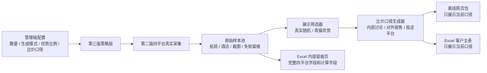

# 青猫差旅比价工具第三版最终执行计划

日期：2026-05-31

状态：方案已通过，进入文档冻结与后续执行阶段。

## 1. 执行结论

第三版不重写第二版四平台采集主链路，而是在第二版已完成的航班、酒店、Excel、离线包能力之上，增加“展示策略层”和“管理端配置层”。

第三版核心目标：

1. 管理端可以选择酒店和航班的展示数量，默认酒店 40 条、航班 20 条。
2. 管理端可以选择生成模式，默认 `真实随机`，也支持 `青猫优势`。
3. `青猫优势` 默认目标比例为 70%，用户可以调整。
4. 酒店和航班分别计算青猫优势比例，不能混在一起算。
5. 管理端可以选择比价口径，默认 `内部讨论`。
6. 离线网页包和 Excel 客户主表只展示当前选择的比价口径。
7. Excel 内部留痕页保留完整计算字段，便于复核。
8. 导出文件名必须反映真实展示数量、是否达标、是否满量。

第三版必须先冻结管理端交互设计，再进入代码实现。管理端不是最后顺手加按钮，而是第三版的第一类核心交付物。

## 2. 第三版新增范围

### 2.1 管理端新增配置

- 酒店展示数量，默认 40。
- 航班展示数量，默认 20。
- 生成模式：
  - `真实随机`：按真实随机采集结果展示，不刻意筛青猫优势。
  - `青猫优势`：后台最多采集展示数量的 2 倍，优先展示青猫优势样本。
- 青猫优势目标比例，默认 70%，只在 `青猫优势` 模式下启用。
- 比价口径：
  - `内部讨论`：青猫差旅 vs 竞品最低价。
  - `对外销售`：根据青猫价格所处位置动态表达。
  - `指定平台`：只与用户指定的 1 个平台比较。
- 导出文件名预览。
- 酒店和航班各自的满量状态、达标状态、当前优势比例。

### 2.2 比价口径

默认口径为 `内部讨论`：

- 青猫差旅价格与竞品最低价比较。
- 青猫低于竞品最低价时，显示低多少。
- 青猫高于竞品最低价时，显示高多少。

`对外销售` 口径：

- 如果青猫是四平台最低价：显示青猫低于竞品平均价多少。
- 如果青猫既不是最低价，也不是最高价：显示青猫高于竞品最低价多少，同时低于竞品最高价多少。
- 如果青猫是四平台最高价：显示青猫高于竞品平均价多少。

`指定平台` 口径：

- 用户只能指定 1 个平台。
- 只比较青猫差旅与该平台。
- 该平台无价格时显示 `暂无`，不参与优势计算。

### 2.3 青猫优势口径

青猫优势默认定义：

- 青猫差旅价格低于可用竞品平均价。
- 无价格的平台显示 `暂无`，不参与平均价计算。
- 航班以每个完整同航班样本计 1 次。
- 酒店以系统选出的默认完整口径计 1 次。
- 酒店其他口径即使显示 `暂无`，也不参与优势比例分母。

`青猫优势` 模式下：

- 航班和酒店分别计算是否达标。
- 任一类未达标，导出文件名前缀使用 `【随】`。
- 酒店和航班均达标，导出文件名前缀使用 `【青】`。
- 即使未满量，也允许导出。
- 即使未达标，也允许导出，但文件名必须明确标识。

### 2.4 导出命名

导出文件名必须包含：

- 前缀：`【青】` 或 `【随】`。
- 产品名：`青猫差旅一体化比价`。
- 实际展示数量：`酒店X-航班Y`。
- 状态：`达标`、`未达标`、`未满量`、`未满量未达标`。

示例：

- `【青】青猫差旅一体化比价-酒店40-航班20-达标.zip`
- `【青】青猫差旅一体化比价-酒店35-航班18-未满量.zip`
- `【随】青猫差旅一体化比价-酒店40-航班20-未达标.zip`
- `【随】青猫差旅一体化比价-酒店35-航班18-未满量未达标.zip`

## 3. 非本版范围

第三版不做以下事项：

- 不新增第五个平台。
- 不改第二版酒店同店判断规则。
- 不改第二版酒店 4 个口径规则。
- 不改第二版航班同航班判断规则。
- 不做公网服务。
- 不做无人值守自动采集。
- 不把截图 OCR 作为主采集方式。
- 不新增普通 OTA 平台。

## 4. 图 1：第三版执行流

## 5. 执行阶段

| 阶段 | 目标 | 产出 |
|---|---|---|
| 阶段 0：第三版方案冻结 | 确认本执行计划和技术路线图 | 两份第三版文档 |
| 阶段 1：管理端交互设计冻结 | 先确定页面风格、配置区、按钮位置、状态展示 | 管理端布局说明和验收标准 |
| 阶段 2：策略模型假数据闭环 | 用假数据验证数量、模式、优势比例、文件名 | 策略层单元测试和假数据导出 |
| 阶段 3：比价口径闭环 | 跑通内部讨论、对外销售、指定平台三种口径 | Excel 和离线包口径一致 |
| 阶段 4：管理端配置接入 | 管理端能传入第三版配置并展示状态 | UI 配置和导出预览 |
| 阶段 5：真实采集策略接入 | 第二版采集结果进入第三版筛选器 | 满量、未满量、达标、未达标状态准确 |
| 阶段 6：导出命名和留痕 | Excel、离线包、文件名全部按第三版规则生成 | 文件名和内部留痕页可复核 |
| 阶段 7：四平台轻量回归 | 确认第三版策略层没有破坏第二版采集结果 | 四平台回归记录 |
| 阶段 8：完整验收 | 完成一次第三版完整真实采集和导出 | 可交付 Excel 与离线包 |

## 6. 为什么仍需要平台级验收

第二版已经完成四平台采集闭环，第三版不重新验收平台从 0 到 1 的能力。

第三版的平台级验收是“轻量回归检查”，目的只有三个：

1. 确认第三版新增的数量、模式、比价口径没有误过滤第二版采集结果。
2. 确认四平台原始价格、截图、失败原因仍能进入内部留痕。
3. 确认管理端新增配置不会让用户误以为平台采集成功，但实际只是策略层补位。

人工确认不是新增业务流程，也不是让用户逐条人工审核。人工确认只在高风险、歧义、首次完整运行时启用。

需要人工确认的典型场景：

- 酒店同店判断存在地址或门牌号歧义。
- 截图肉眼可见价格，但解析结果显示无价格。
- 页面疑似残留旧日期、旧城市、旧搜索结果。
- 第三版第一次完整真实采集后，抽样确认导出物口径。

## 7. 平台级验收计划

| 平台 | 输入条件 | 操作步骤 | 可观察状态 | 成功标准 | 失败停止条件 | 是否需要人工确认 |
|---|---|---|---|---|---|---|
| 青猫差旅 | 已人工登录；可进入航班和酒店页面；第三版配置已填写 | 连接登录窗口；执行轻量航班样本读取；执行轻量酒店样本读取；进入第三版策略层 | 平台状态为可访问；航班候选、酒店候选、价格、截图路径可见 | 航班候选可作为同航班基准；酒店可读取城市、地址、门牌号和 4 个口径；第三版筛选后原始字段仍在留痕页 | 登录失效；候选池为空且无失败原因；日期或城市残留；截图保存失败且无 HTML 快照兜底 | 默认不需要；首次完整运行和候选异常时需要 |
| 携程商旅 | 已人工登录；可搜索同航班和同酒店；青猫样本已确定 | 用青猫航班号搜索同航班；用青猫酒店信息搜索同酒店；读取价格和截图；进入第三版策略层 | 同航班或同酒店状态、价格、截图、失败原因可见 | 同航班不串航班；酒店同店以同城市 + 同门牌号确认；无价格时显示 `暂无` 并进入留痕 | 返回登录页；航班号不一致；酒店门牌号无法确认；截图有价格但解析为无价格 | 默认不需要；价格解析与截图不一致时需要 |
| 阿里商旅 | 已人工登录；可进入航班和酒店链路；青猫样本已确定 | 搜索同航班；搜索酒店候选并进入详情；读取价格、地址、门牌号、截图；进入第三版策略层 | 平台状态、搜索结果、详情页地址、价格、截图路径可见 | 航班链路不误入错误类型；酒店只在详情页确认同店；最多尝试前 3 个高相关详情候选；原始失败原因保留 | 预提交进入错误链路；详情页无法确认同店；页面加载失败；旧结果残留 | 阿里酒店同店首次回归需要抽样人工确认 |
| 在途商旅 | 已人工登录；第二版在途航班和酒店采集可用；青猫样本已确定 | 搜索同航班；搜索同酒店；读取价格和截图；进入第三版策略层 | 在途状态、价格、截图、耗时、失败原因可见 | 航班和酒店结果能稳定返回；无价格时不参与比较但保留留痕；第三版不会因为在途慢加载误判为青猫优势 | 登录失效；加载超时无明确原因；价格区域未加载完成就入库；截图缺失 | 默认不需要；加载超时或页面状态不稳定时需要 |

## 8. 步骤级验收计划

| 步骤 | 输入条件 | 操作步骤 | 可观察状态 | 成功标准 | 失败停止条件 | 是否需要人工确认 |
|---|---|---|---|---|---|---|
| 0. 文档冻结 | 用户确认第三版计划通过 | 新增第三版最终执行计划和全栈技术路线图 | docs 目录出现两份第三版文档 | 文档包含范围、阶段、平台级验收、步骤级验收 | 用户提出核心范围变更 | 需要，当前已通过 |
| 1. 管理端交互设计冻结 | 第三版配置项和状态项已确认 | 固定管理端布局、按钮顺序、配置项位置、状态卡片 | 管理端设计说明明确，不再临时塞按钮 | 用户能判断每个按钮在哪里、每个状态看哪里 | 页面结构无法容纳新增配置；主操作路径不清晰 | 需要 |
| 2. 策略模型假数据闭环 | 有航班和酒店假数据；包含完整和缺失价格样本 | 计算真实随机、青猫优势、满量、达标、文件名前缀 | 测试输出展示数量、优势比例、状态 | 酒店和航班分别计算准确；未满量仍可导出 | 优势比例分母不清；酒店和航班混算 | 不需要 |
| 3. 比价口径闭环 | 有四平台价格样本；包含青猫最低、中间、最高、缺失价格 | 分别生成内部讨论、对外销售、指定平台结论 | 同一样本在三种口径下结论不同且可解释 | 客户主表和离线包只显示当前口径；留痕页保留全部字段 | 无价格平台参与比较；指定平台允许多选 | 不需要 |
| 4. 管理端配置接入 | 管理端设计已冻结；后端接收第三版配置 | 增加配置输入、模式切换、目标比例、导出预览 | 页面可见默认值和变更后的导出预览 | 默认酒店 40、航班 20、真实随机、内部讨论；非法输入有提示 | 点击开始采集时配置丢失；按钮无状态反馈 | 需要做一次界面确认 |
| 5. 真实采集策略接入 | 第二版完整采集可运行；第三版配置已传入 | 执行完整真实采集；原始样本进入策略层筛选 | 采集进度、原始数量、展示数量、失败原因可见 | 真实随机不刻意筛青猫优势；青猫优势最多采集展示数量 2 倍 | 第三版策略影响原始平台采集；旧批次被覆盖且无回退 | 不需要 |
| 6. 导出文件名和状态 | 有采集结果；包含达标、未达标、未满量组合 | 生成 Excel 和离线包 | 文件名展示 `【青】` / `【随】`、数量和状态 | 四个示例场景均命名正确；未满量也允许导出 | 文件名缺状态；实际展示数量与文件名不一致 | 不需要 |
| 7. Excel 客户主表与留痕页 | 有三种比价口径结果 | 导出 Excel；检查客户主表和内部留痕页 | 客户主表只显示当前口径；留痕页字段完整 | 留痕包含四平台原价、竞品最低、竞品平均、竞品最高、选择口径、是否计入优势、是否达标 | 客户主表混入多个口径；留痕无法复算 | 不需要 |
| 8. 离线网页包 | 有第三版筛选结果和截图证据 | 导出离线包并打开首页、航班页、酒店页 | 页面只展示当前比价口径；截图入口可打开 | 无本地服务也可打开；缺失价格显示 `暂无`；导出口径与 Excel 一致 | 页面出现采集按钮；客户页出现内部调试字段 | 需要一次客户视角确认 |
| 9. 四平台轻量回归 | 四个平台已登录；有真实样本 | 按平台级验收计划抽样检查 | 四平台状态和截图证据可见 | 第三版不破坏第二版采集、截图、失败留痕 | 任一平台登录态、采集链路或同店判断异常 | 异常时需要 |
| 10. 第三版完整验收 | 管理端配置已冻结；四平台可用 | 执行一次完整真实采集；导出 Excel 和离线包 | 管理端显示数量、比例、状态、下载链接 | 文件可打开；命名正确；客户主表和离线包一致；留痕可复算 | 采集无明确失败原因；导出物打不开；数据口径不一致 | 需要 |

## 9. 验收通过标准

第三版最终通过必须同时满足：

- 管理端配置清楚，用户不需要猜按钮含义。
- 酒店和航班展示数量分别生效。
- `真实随机` 和 `青猫优势` 都能生成导出物。
- 青猫优势比例分别按酒店和航班计算。
- 未达标和未满量都不阻止导出，但文件名必须准确。
- 离线网页包和 Excel 客户主表只展示当前选择的比价口径。
- Excel 内部留痕页可以复算所有结论。
- 四平台轻量回归通过，确认第二版采集能力没有被第三版策略层破坏。

