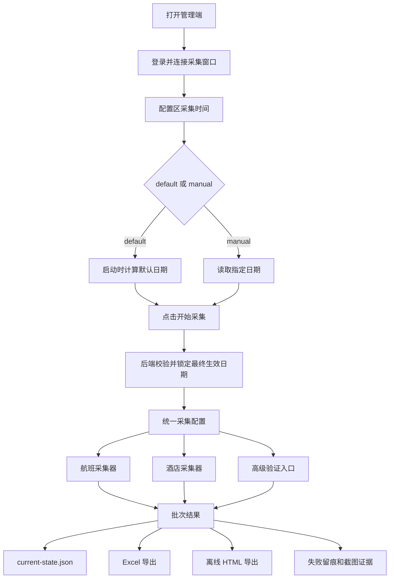

# 青猫差旅比价工具第四版全栈技术路线图

日期：2026-06-03

状态：方案待确认。作为第四版开发的技术依据，确认前不进入代码实现。

## 一、技术路线结论

第四版不换技术栈，不重写系统。

继续沿用当前项目已有结构：

- 前端：React、TypeScript、Vite
- 后端：本地 Express 服务
- 采集：Playwright 连接用户已登录的 Chrome 窗口
- 导出：ExcelJS、离线 HTML
- 测试：Vitest
- 状态：`outputs/current/current-state.json` 和批次输出目录

第四版只新增一条贯穿全栈的能力：管理端配置区可选采集时间。

这里的“采集时间”是目标查询日期，不是定时任务启动时间。航班对应出行日期，酒店对应入住日期和离店日期。

技术上要做的是：

- 前端在管理端配置区增加“采集时间”设置。
- 用户未指定采集时间时，开始采集自动使用默认日期。
- 即使用户未指定采集时间，管理端也要显示默认日期的具体值。
- 用户指定采集时间时，开始采集使用指定日期。
- 后端统一计算、校验和保存本次最终生效日期。
- 采集器统一使用最终生效日期。
- 导出物统一展示这些日期。
- 测试证明没有继续偷偷使用旧默认日期。

## 二、整体架构



核心原则：

- 日期配置只有一个来源：管理端配置区当前采集时间状态。
- 航班和酒店日期分开。
- 酒店离店日期由系统计算，不由用户手填。
- 采集、导出、留痕使用同一份最终生效日期。
- 配置区默认显示“系统默认”和具体默认日期摘要，但不强迫用户展开完整输入控件。
- 后端在启动采集时才锁定本批次最终生效日期。
- 不为第四版建立第二套平行配置系统。

## 三、数据模型

建议新增统一日期配置对象：

```ts
type CollectionDateConfig = {
  mode: "default" | "manual";
  flightTravelDate?: string;
  hotelCheckInDate?: string;
  hotelCheckOutDate?: string;
  hotelNights: 1;
};
```

配置区状态和批次最终生效日期要区分：

- 配置区状态为 `mode = default` 时，也要展示计算出的默认日期摘要。
- 批次启动后必须生成完整的最终生效日期，并写入批次结果、状态文件和导出上下文。

字段说明：

- `mode`：采集时间模式，`default` 表示系统默认，`manual` 表示用户指定。
- `flightTravelDate`：航班出行日期，格式 `YYYY-MM-DD`。
- `hotelCheckInDate`：酒店入住日期，格式 `YYYY-MM-DD`。
- `hotelCheckOutDate`：酒店离店日期，格式 `YYYY-MM-DD`。
- `hotelNights`：第四版固定为 `1`。

计算规则：

- `mode = default` 时，后端在启动采集时计算默认日期。
- 默认 `flightTravelDate = 今天 + 3 天`。
- 默认 `hotelCheckInDate = 今天 + 1 天`。
- `hotelCheckOutDate = hotelCheckInDate + 1 天`。
- `hotelNights` 第四版固定为 `1`。
- `mode = manual` 时，前端传入 `flightTravelDate` 和 `hotelCheckInDate`，后端重新计算 `hotelCheckOutDate`。

保存位置：

- 采集请求需要携带 `mode`。
- `mode = manual` 时，采集请求需要携带指定日期。
- `mode = default` 时，采集请求不需要携带具体日期。
- 当前批次结果需要保存这份配置。
- `current-state.json` 需要保存这份配置。
- 导出上下文需要读取这份配置。
- 当前批次需要保存最终生效日期和来源。
- UI 默认日期摘要必须和后端启动采集时锁定的默认日期保持一致；如果跨日导致默认日期变化，开始采集前应刷新摘要或以最新后端锁定日期为准并回显。

## 四、前端路线

### 4.1 管理端 UI 设计优化

第四版前端第一步不是直接写日期输入框，而是先把“采集时间”设计成管理端配置区里的一个可选配置项。

设计原则：

- “采集时间”放在第三版配置区内，和酒店展示数量、航班展示数量、生成模式、比价口径同一层级。
- 默认状态显示“系统默认”和具体日期摘要，不展开完整输入控件，不要求用户每次采集前确认。
- 用户要改采集时间时，点击配置项进入指定时间设置。
- 用户没改采集时间时，点击“开始完整真实采集”直接按默认日期启动。
- 用户已指定采集时间时，点击“开始完整真实采集”直接按指定日期启动。
- 采集中需要锁定日期，避免一个批次前后查询日期不一致。

UI 需要明确这些状态：

- 未登录或未连接采集窗口
- 待开始采集
- 采集时间为系统默认
- 采集时间已指定
- 采集时间编辑中
- 日期校验失败
- 采集中
- 采集完成
- 采集失败

### 4.2 配置区采集时间流程

推荐流程：

1. 配置区默认显示“采集时间：系统默认”以及具体默认日期摘要。
2. 用户如果不修改，直接点击“开始完整真实采集”。
3. 前端以 `mode = default` 调用后端采集接口。
4. 用户如果要修改，点击“采集时间”。
5. 前端打开指定时间编辑面板或行内编辑区。
6. 用户输入航班出行日期和酒店入住日期。
7. 前端展示自动计算的酒店离店日期。
8. 用户保存后，配置区显示“已指定采集时间”和日期摘要。
9. 用户点击“开始完整真实采集”。
10. 前端以 `mode = manual` 和指定日期调用后端采集接口。

这个流程的关键点：

- 用户没改采集时间时，不能被迫多点一次确认。
- 默认日期的具体值必须在配置区常态展示。
- 用户点击采集时间设置时，可以展示可编辑默认建议值，方便在默认基础上修改。
- 如果高级验证需要真实日期，也读取配置区当前采集时间状态，或明确提示该验证暂未接入统一日期。

### 4.3 指定时间内容

展示内容：

- 航班出行日期输入框
- 酒店入住日期输入框
- 酒店离店日期只读展示
- 酒店入住晚数只读展示：1 晚
- 保存指定时间按钮
- 恢复默认按钮

### 4.4 交互状态

需要处理：

- 默认状态：配置区显示“采集时间：系统默认”和具体默认日期摘要。
- 指定状态：配置区显示“采集时间：已指定”，并显示简短日期摘要。
- 编辑状态：显示系统自动算出的默认建议日期，并允许用户修改。
- 手动修改：立即重新计算酒店离店日期。
- 无效日期：显示明确错误，不允许开始采集。
- 采集中：锁定日期输入，避免同一批次前后日期不一致。
- 采集完成：当前批次卡片显示本次实际使用日期。

### 4.5 文案口径

页面文案用人话：

- “航班出行日期”
- “酒店入住日期”
- “酒店离店日期”
- “当前酒店固定采 1 晚”
- “本次采集会按以上日期查询”
- “采集时间”
- “系统默认”
- “默认航班出行”
- “默认酒店入住”
- “默认酒店离店”
- “指定时间”
- “保存指定时间”
- “恢复默认”

避免使用：

- “date config”
- “payload”
- “override”
- “schema”

## 五、后端路线

### 5.1 配置入口

后端需要有统一方法读取日期配置。

推荐做法：

- 在现有采集请求或采集配置能力上扩展日期字段。
- 不新建一套和当前配置无关的平行系统。
- 正式采集接口和高级验证接口都从同一个方法取日期。
- 日期配置以“配置区当前状态”和“本次批次”为边界。
- 采集请求明确传入 `mode = default` 或 `mode = manual`。
- 当前状态接口可以返回配置区当前采集时间状态，以及正在运行或最近一次批次实际使用的日期。

需要覆盖的接口类型：

- 完整真实采集启动接口
- 国内航班真实采集启动接口
- 国际航班真实采集启动接口
- 酒店真实采集启动接口
- 需要真实日期的高级验证接口
- 当前状态接口中的当前批次或上一批次日期展示

不需要覆盖：

- 未展开采集时间设置时的完整输入控件
- 只用于展示系统是否在线的健康检查

原接口类型中需要调整的入口：

- 完整真实采集接口
- 国内航班真实采集接口
- 国际航班真实采集接口
- 酒店真实采集接口
- 相关高级验证接口

### 5.2 校验规则

后端统一校验：

- `mode` 必须是 `default` 或 `manual`。
- `mode = default` 时，后端在启动采集时计算默认日期。
- `mode = manual` 时，航班出行日期不能为空。
- `mode = manual` 时，酒店入住日期不能为空。
- 日期必须是 `YYYY-MM-DD`。
- 酒店离店日期由后端计算，不信任前端传入值。
- 酒店入住晚数第四版固定为 1。

如果校验失败：

- 接口返回明确错误。
- 前端显示用户能看懂的原因。
- 不启动真实采集。

### 5.3 批次保存

每个批次都保存：

- `mode`
- `flightTravelDate`
- `hotelCheckInDate`
- `hotelCheckOutDate`
- `hotelNights`
- 日期来源：默认或手动

这些字段需要进入：

- 当前批次对象
- `current-state.json`
- Excel 导出上下文
- 离线 HTML 导出上下文
- 失败留痕

这些字段在启动采集后写入当前批次。配置区默认日期摘要可以轻量计算和展示，但不能被误认为已经生成了采集批次。

## 六、采集器路线

### 6.1 航班采集

航班采集器要改成使用传入的 `flightTravelDate`。

影响范围：

- 国内航班
- 国际航班
- 读取青猫候选池
- 随机同航班比价
- 完整真实采集里的航班部分

验收重点：

- 页面搜索日期等于本次最终生效日期。
- 截图证据能看到同样的日期。
- 失败记录带上目标出行日期。

### 6.2 酒店采集

酒店采集器要使用：

- `hotelCheckInDate`
- `hotelCheckOutDate`
- `hotelNights = 1`

影响范围：

- 酒店真实采集
- 酒店单条诊断
- 酒店小批量验证
- 酒店封面图验证
- 完整真实采集里的酒店部分

验收重点：

- 平台查询使用同一组入住/离店日期。
- 青猫和竞品酒店比较不能混用不同入住日期。
- 失败记录带上入住日期和离店日期。

### 6.3 高级验证

高级验证不能再默认各自偷偷算日期。

处理方式：

- 能接入统一日期的，直接接入。
- 暂时不能接入的，在 UI 和结果里明确标记。
- 不允许无提示继续使用旧默认日期。

## 七、导出路线

### 7.1 Excel

Excel 需要体现日期：

- 汇总页展示本批次日期说明。
- 航班行保留出行日期。
- 酒店行保留入住日期和离店日期。
- 留痕页保留本次日期配置。
- 失败记录写明目标日期。

客户看到 Excel 时，需要知道：

- 航班价格对应哪一天。
- 酒店价格对应哪一天入住、哪一天离店。

### 7.2 离线 HTML

离线演示页顶部展示：

- 数据更新时间
- 航班出行日期
- 酒店入住日期
- 酒店离店日期

航班卡片和酒店卡片也应保持日期清晰，避免客户误解成所有日期都适用。

### 7.3 截图证据

截图文件名不一定要强行包含日期，但截图索引和留痕必须能关联：

- 批次 ID
- 平台
- 航线或酒店
- 查询日期
- 截图路径

## 八、测试路线

第四版测试重点不是“平台能不能采”，而是“日期有没有传到底”。

建议增加或调整测试：

- 配置区显示“采集时间：系统默认”和具体默认日期测试。
- 未指定采集时间时，以 `mode = default` 启动采集测试。
- 指定采集时间时，以 `mode = manual` 和指定日期启动采集测试。
- 点击“采集时间”后出现指定时间编辑测试。
- 恢复默认后重新以 `mode = default` 启动采集测试。
- 默认日期启动时后端计算测试。
- 酒店离店日期自动加 1 天测试。
- 无效日期校验测试。
- 正式采集接口接收手动日期测试。
- 航班采集参数使用 `flightTravelDate` 测试。
- 酒店采集参数使用 `hotelCheckInDate` 和 `hotelCheckOutDate` 测试。
- Excel 导出包含日期测试。
- 离线 HTML 导出包含日期测试。
- `current-state.json` 保存日期测试。

回归验证：

- `npm test`
- `npm run typecheck`
- `npm run build`

真实验证：

- 先跑 1 条航班，确认日期生效。
- 再跑 1 条酒店，确认日期生效。
- 最后是否跑完整真实采集，单独向用户确认。

## 九、风险控制

### 9.1 配置区采集时间过重

问题：

采集时间设置如果做得太重，会让用户每次采集都误以为必须先填日期。

控制：

- 配置区默认显示“系统默认”和简短日期摘要。
- 只有点击采集时间设置时，才展开完整指定时间编辑。
- 用户未指定时间时，开始采集直接使用默认日期。

### 9.2 日期状态分裂

问题：

配置区显示一个采集时间状态，后端采集用了另一个日期。

控制：

- 采集请求明确传入 `mode = default` 或 `mode = manual`。
- 后端返回最终生效日期。
- 采集结果保存最终生效日期。
- 前端显示“本次实际使用日期”。

### 9.3 旧默认日期残留

问题：

某个采集入口仍然写死未来第 3 天或明天入住。

控制：

- 全局搜索旧日期计算入口。
- 统一改为读取配置。
- 测试覆盖正式采集和高级验证。

### 9.4 平台页面没有切到目标日期

问题：

系统传了日期，但平台页面实际停留在旧日期。

控制：

- 采集后读取页面可见日期。
- 如果页面日期和目标日期不一致，标记为失败。
- 截图证据保留页面真实状态。

### 9.5 酒店多晚需求提前膨胀

问题：

第四版中途加入 2 晚、3 晚，会让酒店采集和导出口径变复杂。

控制：

- 第四版字段保留 `hotelNights`，但固定为 1。
- 不开放多晚选择。
- 多晚作为后续版本单独评估。

### 9.6 第五版平台提前混入

问题：

新增平台和日期配置同时开发，会导致失败原因无法判断。

控制：

- 第四版代码不新增平台枚举。
- 第四版不写美团、携程旅行、去哪儿、同程/同城相关采集器。
- 第五版再做平台可行性调研、登录验证和试采。

## 十、交付物

第四版交付物：

- 管理端配置区采集时间设置。
- 配置区支持“系统默认”和“指定时间”两种状态。
- 系统默认状态也明确展示具体默认日期。
- 后端统一校验本次采集日期。
- 航班采集使用本次最终生效的出行日期。
- 酒店采集使用本次最终生效的入住/离店日期。
- 高级验证使用或明确标记本次日期配置。
- Excel 展示并留痕本次日期。
- 离线 HTML 展示本次日期。
- 当前状态保存本次批次日期。
- 测试和构建通过。
- 最小真实样本验证通过。

第五版候选交付物：

- 美团可行性验证。
- 携程旅行普通 OTA 可行性验证。
- 去哪儿旅行可行性验证。
- 同程/同城旅行可行性验证。
- 新平台登录、风控、搜索、截图、价格解析、同房同航班匹配规则评估。

## 十一、确认门槛

本路线图通过后，才进入第四版代码实现。

确认前不写采集代码、不改页面代码、不改测试代码。

请确认：以上全栈技术路线是否通过？
