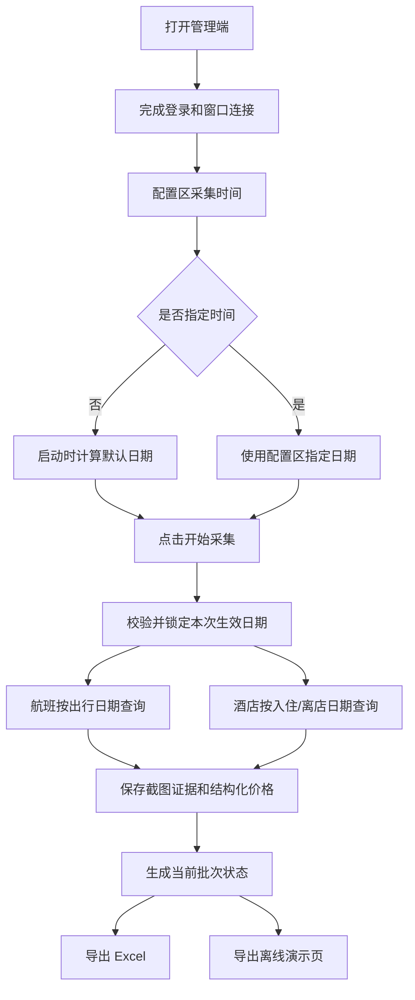

# 青猫差旅比价工具第四版最终执行计划

日期：2026-06-03

状态：方案待确认。确认前不进入代码实现。

## 一、执行结论

第四版只做一件事：在管理端配置区增加可选的采集时间设置。

本文里的“采集时间”指本次查询的目标日期，包括航班出行日期、酒店入住日期和酒店离店日期；不是无人值守定时任务，也不是几点几分自动启动采集。

本版不新增平台。美团、携程旅行、去哪儿旅行、同程/同城旅行统一放到第五版再评估和开发，避免第四版同时改采集日期和平台采集链路，导致问题混在一起不好验收。

第四版锁定后的范围如下：

- 航班在管理端可设置“出行日期”。
- 酒店在管理端可设置“入住日期”。
- 航班和酒店的日期分开配置。
- 采集时间入口放在管理端配置区，和酒店展示数量、航班展示数量、生成模式、比价口径这些配置放在同一块。
- 用户如果要改采集时间，就在配置区选择指定时间，再点击开始采集。
- 用户如果不改采集时间，直接点击开始采集，系统按默认时间采集。
- 即使使用系统默认时间，管理端 UI 也必须明确显示具体默认日期。
- 航班默认仍是未来第 3 天。
- 酒店默认是明天入住。
- 酒店第四版只支持住 1 晚，离店日期自动等于入住日期后 1 天。
- 正式完整采集和相关高级验证都必须使用同一套日期配置。
- Excel、离线演示页、当前批次状态、后台留痕、失败原因里都要能看出本次使用的采集日期。

一句人话：第四版不是“多接几个平台”，而是在配置区加一个“采集时间”。你不改就按默认时间跑，你改了就按你指定的时间跑。

## 二、第四版新增范围

### 2.1 管理端配置区采集时间设置

管理端配置区需要新增一个轻量的“采集时间”设置，建议放在当前第三版配置区内，和已有配置保持同一视觉层级。

推荐交互：

1. 配置区显示“采集时间”。
2. 默认状态显示“系统默认”和具体日期摘要。
3. 用户如果不改，直接点击开始采集。
4. 用户如果要改，点击“采集时间”进入指定时间设置。
5. 指定时间设置里填写航班出行日期和酒店入住日期。
6. 保存后，配置区显示“已指定采集时间”以及简短日期摘要。
7. 用户点击开始采集后，系统按配置区当前状态启动采集。

指定时间设置需要展示：

- 航班出行日期
- 酒店入住日期
- 酒店离店日期
- 酒店入住晚数

其中：

- 航班出行日期可以手动修改。
- 酒店入住日期可以手动修改。
- 酒店离店日期由系统自动计算，只展示，不单独编辑。
- 酒店入住晚数第四版固定为 1 晚，只展示，不做多晚选择。
- 开始采集前可以调整或恢复默认。
- 采集一旦开始，本批次日期锁定，不能中途修改。

采集时间设置需要提供“恢复默认”动作：

- 配置区恢复为“系统默认”，并显示当前计算出的具体默认日期。
- 后端在真正启动采集时计算默认航班出行日期和默认酒店入住日期。
- 默认航班出行日期为未来第 3 天。
- 默认酒店入住日期为明天。
- 默认离店日期为入住日期后 1 天。

### 2.2 日期规则

航班规则：

- 默认出行日期为当前日期后第 3 天。
- 用户可以改成其他日期。
- 日期不能是明显无效日期。
- 如果平台不支持某个日期，应在采集失败原因里明确写出来。

酒店规则：

- 默认入住日期为明天。
- 用户可以改成其他日期。
- 第四版固定住 1 晚。
- 离店日期永远等于入住日期后 1 天。
- 如果平台不支持某个入住日期，应在采集失败原因里明确写出来。

日期口径：

- 所有日期统一使用本机当前时区下的自然日。
- 对外展示统一使用 `YYYY-MM-DD`。
- 不在第四版引入小时、分钟、时区选择。

### 2.3 作用范围

第四版日期配置必须影响这些正式能力：

- 完整真实采集
- 国内航班真实采集
- 国际航班真实采集
- 酒店真实采集
- 当前批次生成
- Excel 导出
- 离线演示页导出

第四版日期配置也应影响这些相关高级验证：

- 读取青猫候选航班
- 随机同航班比价
- 酒店单条诊断
- 酒店小批量验证
- 酒店封面图验证

如果某个高级验证暂时不能接入统一日期，页面必须明确提示“此验证暂未使用管理端日期配置”，不能继续偷偷使用旧默认日期。

### 2.4 导出和留痕

Excel 需要体现：

- 航班出行日期
- 酒店入住日期
- 酒店离店日期
- 酒店入住晚数
- 后台留痕页中的本次日期配置
- 失败记录中的目标日期

离线演示页需要体现：

- 当前数据对应的航班出行日期
- 当前数据对应的酒店入住日期和离店日期
- 不要让销售或客户误以为这是系统当天所有日期的价格。

当前状态文件需要保存：

- 本次批次使用的航班出行日期
- 本次批次使用的酒店入住日期
- 本次批次使用的酒店离店日期
- 本次批次使用的酒店入住晚数

截图证据和失败留痕需要能反查：

- 这张截图是哪个日期的查询结果。
- 这个失败是哪个日期下发生的。

## 三、非本版范围

第四版明确不做：

- 不新增美团。
- 不新增携程旅行普通 OTA。
- 不新增去哪儿旅行。
- 不新增同程/同城旅行。
- 不做酒店多晚入住。
- 不做每家酒店单独设置日期。
- 不做每条航线单独设置日期。
- 不改现有比价口径。
- 不重写采集系统。
- 不做账号密码自动登录。
- 不做无人值守定时采集。
- 不引入 OCR 作为主采集方式。

这些内容可以进入第五版候选范围，但不混入第四版。

## 四、用户路径

第四版完成后，用户路径应变成：

1. 打开管理端。
2. 完成当前平台账号登录和采集窗口连接。
3. 在管理端配置区查看“采集时间”状态。
4. 如果要改采集时间，就在配置区选择指定时间。
5. 如果不改采集时间，保持“系统默认”即可，但页面仍然显示具体默认日期。
6. 点击开始完整真实采集。
7. 系统根据配置区状态决定本次生效日期：已指定就用指定日期，未指定就计算默认日期。
8. 系统按本次生效日期采集航班和酒店。
9. 采集完成后导出 Excel 和离线演示页。
10. 导出物里能看出这批数据对应的日期。

打开管理端但尚未登录、尚未连接采集窗口时，配置区可以显示“采集时间：系统默认”和具体默认日期。这个日期只来自本地/后端的轻量日期计算，不代表已经开始真实采集。

流程图：

## 五、执行阶段

### 阶段 0：方案确认

目标：

- 确认第四版只做管理端配置区的可选采集时间设置。
- 确认新平台放到第五版。
- 确认“未指定时间就按默认时间采集，已指定时间就按指定时间采集”。
- 确认系统默认状态也要显示具体默认日期。
- 确认酒店第四版固定 1 晚。

验收标准：

- 用户确认本文档。
- 用户确认第四版全栈技术路线图。
- 用户确认新平台放到第五版。
- 用户确认酒店第四版只做 1 晚。
- 用户确认采集时间入口放在管理端配置区。
- 用户确认开始采集时不强制二次日期确认。

是否需要人工参与：

- 需要。用户必须确认方案通过后，才进入代码实现。

### 阶段 1：管理端前端 UI 设计与交互优化

目标：

- 先确定管理端 UI 怎么改，再写代码。
- 把“采集时间”放进管理端配置区，和酒店展示数量、航班展示数量、生成模式、比价口径同一层级。
- 默认状态显示“系统默认”和具体日期摘要。
- 用户需要修改时，再进入指定时间设置。
- 优化正式采集操作区，让用户配置完后直接点击开始采集。
- 明确未登录、未连接、默认时间、已指定时间、日期校验失败、采集中、采集完成、采集失败这些状态的界面表现。
- 明确按钮、输入框、错误提示、禁用态、加载态、当前批次日期展示的位置和文案。

验收标准：

- 配置区新增“采集时间”设置，视觉上和现有配置项一致。
- 默认状态显示“系统默认”以及具体默认日期，用户不需要进入编辑也能知道本次会采哪一天。
- 点击“采集时间”后，才出现可编辑的航班出行日期、酒店入住日期、酒店离店日期、酒店 1 晚说明。
- 未指定时间时，点击“开始完整真实采集”会直接按默认日期启动，不再强制弹日期确认。
- 已指定时间时，点击“开始完整真实采集”会直接按指定日期启动。
- 酒店入住日期变化时，离店日期的设计规则明确。
- 采集中日期输入不可修改，避免同一批次日期前后不一致。
- UI 文案不使用技术词，用户能直接理解下一步会发生什么。

是否需要人工参与：

- 需要。用户需要确认采集时间在配置区里的位置、默认状态文案、展开/编辑方式是否符合实际操作习惯。

### 阶段 2：管理端配置区采集时间落地

目标：

- 按阶段 1 确认的 UI 方案实现前端交互。
- 配置区支持“系统默认”和“指定时间”两种状态。
- 用户没有指定时间时，配置区也展示具体默认日期，前端启动采集请求时标记使用默认日期。
- 用户指定时间后，前端启动采集请求时携带指定日期。
- 高级验证如果需要真实采集日期，也读取配置区同一套采集时间状态，或明确提示没有接入。

验收标准：

- 配置区能看到“采集时间：系统默认”和具体默认日期。
- 点击采集时间设置后，可以进入指定时间编辑。
- 航班出行日期可以修改。
- 酒店入住日期可以修改。
- 酒店离店日期自动等于入住日期后 1 天。
- 用户不指定时间，也可以直接启动真实采集。
- 用户指定时间后，启动采集会带上指定日期。
- 点击“恢复默认”后，启动采集不再带手动日期，而是让后端按默认规则计算。
- 日期错误时，前端阻止采集并显示明确原因。

是否需要人工参与：

- 需要少量参与。用户需要在管理端手动设置一次指定时间、恢复一次默认，并确认交互是否顺手。

### 阶段 3：后端日期配置

目标：

- 后端统一处理采集请求里的日期模式。
- 后端支持两种模式：使用默认日期、使用指定日期。
- 后端生成最终生效日期，前端传来的离店日期只作为展示参考，不作为可信来源。
- 所有正式采集入口都从同一套日期配置读取日期。
- 不再让正式采集继续使用隐藏默认日期。

验收标准：

- 手动选择日期后，后端采集任务能拿到同样的日期。
- 未手动选择日期时，后端在启动采集时按默认规则生成日期。
- 无效日期会给出明确错误。
- 后端自动计算酒店离店日期。
- 当前批次保存的是本次最终生效日期，并标记来源为默认或手动。

是否需要人工参与：

- 通常不需要。只有当日期校验规则或错误文案需要业务确认时，才需要用户参与。

### 阶段 4：采集链路接入

目标：

- 航班采集按本次生效的出行日期查询。
- 酒店采集按本次生效的入住日期和离店日期查询。
- 相关高级验证按同一日期运行。
- 截图、失败原因、结构化结果都带上本次目标日期。

验收标准：

- 航班截图里的日期与本次生效日期一致。
- 酒店截图里的入住/离店日期与本次生效日期一致。
- 失败原因能说明具体日期。
- 如果平台实际页面没有切到目标日期，采集结果不能按成功处理。
- 高级验证不能无提示继续使用旧默认日期。

是否需要人工参与：

- 需要。真实采集依赖用户保持相关平台账号已登录，并且完整采集启动前需要用户确认。

### 阶段 5：导出和留痕接入

目标：

- Excel 写入本次日期配置。
- 离线演示页展示本次数据日期。
- 当前状态文件保存本次日期。
- 后台失败记录保存目标日期。

验收标准：

- Excel 汇总页和留痕页能看出日期。
- 离线演示页顶部能看出日期。
- 当前状态文件里能查到同样的日期。
- 失败记录里能看出目标出行日期或入住/离店日期。

是否需要人工参与：

- 开发过程中不需要。验收时建议用户打开一次 Excel 和离线演示页确认展示口径。

### 阶段 6：测试和轻量真实验证

目标：

- 用最小样本证明日期配置真的生效。
- 先做自动化测试，再做轻量真实验证，最后再决定是否完整采集。

验收标准：

- 自动化测试通过。
- 构建通过。
- 配置区默认状态显示具体默认日期的测试通过。
- 不指定时间时按默认日期启动的测试通过。
- 指定时间时按手动日期启动的测试通过。
- 至少 1 条航班验证所选日期生效。
- 至少 1 条酒店验证所选日期生效。
- 完整真实采集前单独向用户确认。

是否需要人工参与：

- 需要。轻量真实验证和完整真实采集都需要用户确认账号登录状态、采集日期和是否启动。

## 六、验收清单

第四版验收时重点看这些：

- 管理端配置区新增“采集时间”设置。
- 默认状态是“系统默认”，同时显示具体默认日期，用户不选择也能开始采集。
- 点击采集时间设置后，能设置航班出行日期。
- 点击采集时间设置后，能设置酒店入住日期和离店日期。
- 航班日期和酒店日期可以分开改。
- 酒店第四版固定 1 晚。
- 未指定时间时，正式完整采集使用默认日期。
- 已指定时间时，正式完整采集使用指定日期。
- 高级验证尽量使用管理端日期；不能使用的地方有明确提示。
- Excel 写入本次日期。
- 离线演示页展示本次日期。
- 当前状态和失败留痕记录本次日期。
- 不新增任何第五版平台。
- 不改变现有比价口径。
- 不生成不完整批次来冒充成功。

## 七、主要风险和处理

### 风险 1：配置区采集时间过重，打断真实操作路径

处理：

- 配置区默认显示“系统默认”和简短日期摘要。
- 只有用户点击采集时间设置时，才展开完整输入控件。
- 不要求用户每次采集前都确认日期。

### 风险 2：用户指定了时间，但采集仍用默认值

处理：

- 采集请求明确带上日期模式：默认或手动。
- 采集前后都记录本次生效日期和来源。
- 截图和结构化结果里都保留日期。
- 测试覆盖“手动日期传到采集入口”。

### 风险 3：高级验证遗漏，仍使用旧日期

处理：

- 列出所有采集入口逐个接入。
- 暂时不能接入的入口必须在页面写明。
- 验收时专门检查高级验证区。

### 风险 4：酒店日期和航班日期混在一起

处理：

- 航班只使用航班出行日期。
- 酒店只使用入住/离店日期。
- 数据结构上分开保存。

### 风险 5：用户以后想做多晚入住

处理：

- 第四版只固定 1 晚。
- 技术上保留 `入住晚数` 字段，但界面不开放多晚选择。
- 第五版或后续版本再决定是否开放。

### 风险 6：新平台诱惑导致第四版失控

处理：

- 第四版不新增平台。
- 第五版单独做平台可行性调研和试采。
- 第四版验收只看日期配置是否打通。

## 八、第四版完成标准

第四版完成后，应达到：

- 管理端配置区有“采集时间”设置。
- 用户不设置采集时间时，系统按默认日期采集。
- 用户设置采集时间时，系统按指定日期采集。
- 系统正式采集不再只能使用隐藏默认日期，也不会强迫每次二次确认日期。
- Excel、离线页、后台留痕都能说明本批次日期。
- 旧的完整真实采集能力不被破坏。
- 新平台没有被混进第四版。

## 九、确认门槛

本计划通过后，才进入第四版代码实现。

确认前不写采集代码、不改页面代码、不改测试代码。

请确认：以上产品与执行方案是否通过？
